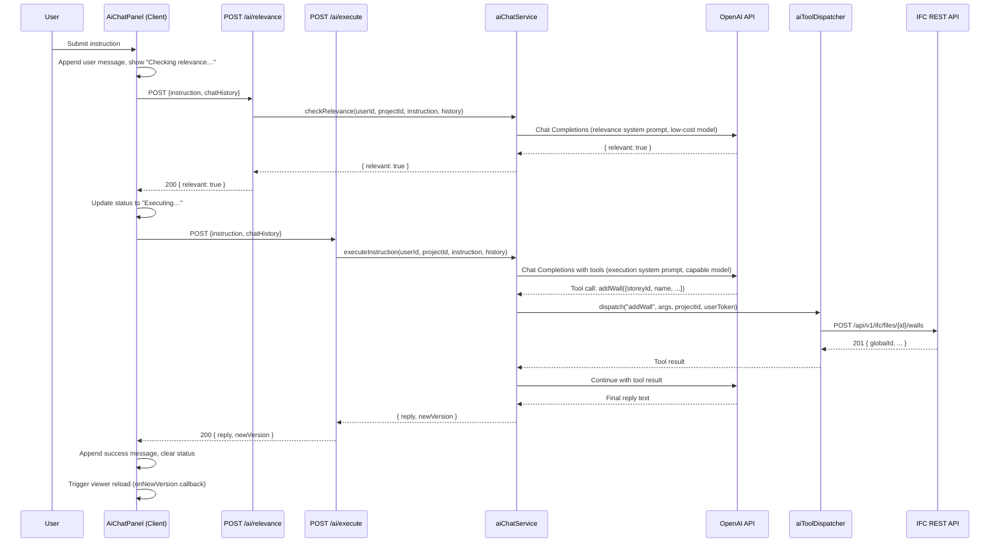
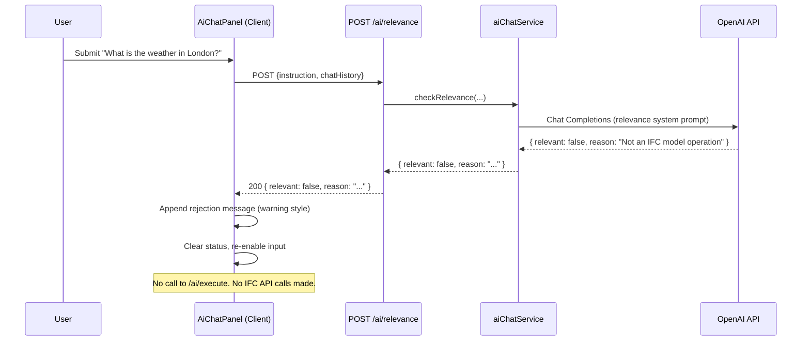
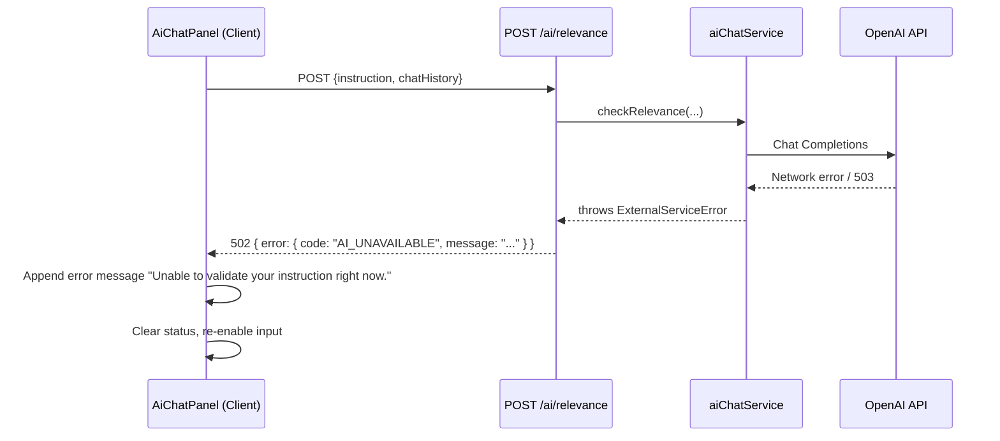
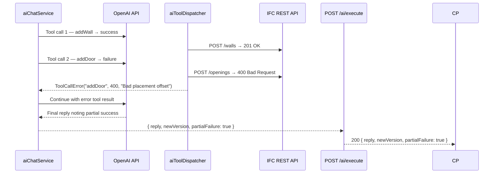

# AI Chat Panel — Application Design

## Metadata

| Field            | Value                                                                                         |
|------------------|-----------------------------------------------------------------------------------------------|
| **Use Case**     | [UC-USR-026 — AI Chat Panel for IFC Model Editing](../../specification/useCases/user/aiChatPanel.md) |
| **Feature**      | [F-040 — AI chat panel — natural-language IFC model editing](../../specification/features/ifc/aiChatPanel.feature) |
| **UI Mockup**    | [design/ui/aiChatPanel.html](../ui/aiChatPanel.html)                                          |
| **Status**       | Draft                                                                                         |
| **Created**      | 2026-03-19                                                                                    |
| **Last Updated** | 2026-03-19                                                                                    |

## Summary

The AI chat panel is embedded in the existing project workspace alongside the 3D IFC viewer. The user types a natural-language instruction; the system calls the OpenAI Chat Completions API twice — once (cheaply and quickly) to check relevance, and once (with tools) to execute as the AI agent. The agent issues IFC REST API calls via an internal MCP-style tool dispatch layer. On success the viewer is polled for a new model version and re-renders automatically. The feature introduces two new Next.js API routes, one service module, and a new Client Component that extends the existing workspace page.

---

## Modules & Components

### High-Level Module Map

| Module                        | Path                                                           | Responsibility                                                                           |
|-------------------------------|----------------------------------------------------------------|------------------------------------------------------------------------------------------|
| Workspace Page                | `src/app/projects/[projectId]/workspace/page.tsx`             | **Modified** — passes `projectId` to `AiChatPanel` in addition to `IfcViewer`           |
| AI Chat Panel Component       | `src/components/ifc/aiChatPanel.tsx`                          | Client component — chat UI, state machine, streaming status indicators, re-render trigger |
| Chat Hook                     | `src/hooks/useAiChat.ts`                                      | Custom hook — manages chat history state, sends instructions, handles responses           |
| Relevance Check API Route     | `src/app/api/projects/[projectId]/ai/relevance/route.ts`      | POST — validates JWT, calls `aiChatService.checkRelevance()`, returns verdict             |
| Execute Instruction API Route | `src/app/api/projects/[projectId]/ai/execute/route.ts`        | POST — validates JWT, calls `aiChatService.executeInstruction()`, returns result          |
| AI Chat Service               | `src/modules/ifc/aiChatService.ts`                            | Application service — orchestrates relevance check and execution against OpenAI           |
| OpenAI Client                 | `src/services/openAiClient.ts`                                 | Thin wrapper around the OpenAI Chat Completions API — manages auth, retries, error mapping |
| IFC Tool Dispatcher           | `src/modules/ifc/aiToolDispatcher.ts`                         | Maps OpenAI function-call tool names to authenticated IFC REST API calls                 |
| AI Types                      | `src/types/aiChat.ts`                                         | TypeScript interfaces for chat messages, API request/response shapes, tool definitions    |
| Environment Variables         | `src/lib/env.ts`                                              | **Modified** — adds `openAiApiKey` and `openAiModel` accessors                           |

### Component Hierarchy

The workspace page layout changes from a full-screen viewer to a side-by-side split:

```
WorkspacePage (Server)
└── WorkspaceLayout (Client — flex row, resizable split)
    ├── IfcViewer (Client — existing, extended with onNewVersion callback)
    └── AiChatPanel (Client — new)
        ├── ChatHeader (static — title, Clear button)
        ├── ChatHistory (scrollable list of ChatMessage items)
        │   ├── UserMessage (user bubble)
        │   └── AssistantMessage (AI bubble — neutral / success / warning / error variant)
        ├── StatusBar (inline — "Checking relevance…" / "Executing…" / hidden)
        └── ChatInput (textarea + Send button)
```

`WorkspacePage` remains a **Server Component**. `AiChatPanel` and `IfcViewer` are **Client Components** (`"use client"`). The `"use client"` boundary for the new split layout wrapper sits at `WorkspaceLayout`.

---

## Sequence Diagrams

### Main Flow — Instruction Submitted, Relevant, Executed Successfully



### Relevance Rejection Flow



### OpenAI Service Unavailable



### Partial IFC API Failure



---

## Folder Structure

Files to be **created** (✦) or **modified** (✎):

```
src/
  app/
    projects/
      [projectId]/
        workspace/
          page.tsx ✎              # Add AiChatPanel alongside IfcViewer
    api/
      projects/
        [projectId]/
          ai/
            relevance/
              route.ts ✦          # POST — relevance check
            execute/
              route.ts ✦          # POST — execution + tool dispatch
  components/
    ifc/
      aiChatPanel.tsx ✦           # Client component — chat UI
      ifcViewer.tsx ✎             # Add onNewVersion prop + callback
  hooks/
    useAiChat.ts ✦                # Chat state machine hook
  modules/
    ifc/
      aiChatService.ts ✦          # Application service — relevance + execution
      aiToolDispatcher.ts ✦       # Maps tool names → IFC REST API calls
  services/
    openAiClient.ts ✦             # OpenAI API wrapper (Chat Completions)
  types/
    aiChat.ts ✦                   # Shared TS interfaces
  lib/
    env.ts ✎                      # Add openAiApiKey, openAiModel accessors
```

---

## Data Model

```typescript
// src/types/aiChat.ts

/** A single turn in the chat history sent to and from API routes */
export interface ChatMessage {
  role: "user" | "assistant";
  /** Plain text content shown in the chat panel */
  content: string;
  /** Optional variant drives bubble styling */
  variant?: "neutral" | "success" | "warning" | "error";
}

/** POST /api/projects/:id/ai/relevance */
export interface RelevanceRequest {
  instruction: string;
  /** Last N messages sent for context (bounded to avoid token limits) */
  chatHistory: ChatMessage[];
}

export interface RelevanceResponse {
  relevant: boolean;
  /** Human-readable reason returned to the user only when relevant === false */
  reason?: string;
}

/** POST /api/projects/:id/ai/execute */
export interface ExecuteRequest {
  instruction: string;
  chatHistory: ChatMessage[];
}

export interface ExecuteResponse {
  /** The AI agent's reply to show in the chat panel */
  reply: string;
  /** Updated model version after execution (undefined if nothing mutated) */
  newVersion?: number;
  /** True when some (but not all) operations in a multi-step instruction succeeded */
  partialFailure?: boolean;
}

/** Internal to aiChatService — describes a single tool call the agent wants to make */
export interface AiToolCall {
  id: string;
  name: string;
  arguments: Record<string, unknown>;
}

/** Internal to aiToolDispatcher — result of dispatching one tool call */
export interface ToolCallResult {
  toolCallId: string;
  /** JSON-serialisable result to feed back to the model */
  result: unknown;
  /** Set when the IFC API returned an error for this call */
  error?: string;
}
```

---

## API Design

### POST `/api/projects/[projectId]/ai/relevance`

| Field          | Detail                                                                 |
|----------------|------------------------------------------------------------------------|
| **Auth**       | Supabase JWT required (`Authorization: Bearer <token>`)                |
| **Request**    | `RelevanceRequest` JSON body                                           |
| **Response**   | `{ data: RelevanceResponse }` — always 200 for application-level outcomes |
| **Errors**     | 400 validation, 401 unauthenticated, 404 project not found, 502 OpenAI unavailable |

The route handler does **not** return 4xx for a "not relevant" answer — that is an application-level outcome surfaced via `relevant: false` in the 200 body.

```typescript
// Error response shapes
// 400 — Validation error
{ error: { code: "VALIDATION_ERROR", message: "instruction must not be empty" } }

// 401 — Not authenticated
{ error: { message: "Authentication required." } }

// 502 — OpenAI unreachable
{ error: { code: "AI_UNAVAILABLE", message: "Unable to reach the AI service. Please try again." } }
```

### POST `/api/projects/[projectId]/ai/execute`

| Field          | Detail                                                                 |
|----------------|------------------------------------------------------------------------|
| **Auth**       | Supabase JWT required                                                  |
| **Request**    | `ExecuteRequest` JSON body                                             |
| **Response**   | `{ data: ExecuteResponse }` — always 200 for application-level outcomes |
| **Errors**     | 400 validation, 401 unauthenticated, 404 project not found, 502 OpenAI unavailable |

Tool-call failures from the IFC REST API are surfaced in the `reply` text and `partialFailure` flag of the 200 body — they are not propagated as HTTP errors.

---

## Authentication & Authorisation

- **Authentication method**: Supabase JWT, verified server-side in every API route handler via `createServerClient()` and `supabase.auth.getUser()`, consistent with all other project routes.
- **Protected routes**: Both `/api/projects/[projectId]/ai/relevance` and `/api/projects/[projectId]/ai/execute` require a valid JWT. Unauthenticated requests receive `401 Unauthorized`.
- **Resource authorisation**: `aiChatService` calls `projectService.getProject(userId, projectId)` at the start of every operation — this throws `NotFoundError` (→ 404) if the project does not belong to the authenticated user, preventing cross-user access.
- **IFC API calls from the tool dispatcher**: `aiToolDispatcher` passes the authenticated user's Supabase JWT through to each IFC REST API call. The dispatcher never holds a separate elevated service token — it operates strictly within the user's own permissions, so all existing IFC authorisation rules apply automatically.
- **No client-side AI calls**: The OpenAI API key is never sent to the browser. All OpenAI requests originate from the Next.js API route handlers (server side only).

---

## Secrets & Environment Variables

| Variable              | Purpose                                                         | Server / Client | Example                      |
|-----------------------|-----------------------------------------------------------------|-----------------|------------------------------|
| `OPENAI_API_KEY`      | Authenticates requests to the OpenAI Chat Completions endpoint  | **Server only** | `sk-proj-abc123...`          |
| `OPENAI_RELEVANCE_MODEL` | Model used for the lightweight relevance check (fast, cheap) | **Server only** | `gpt-4o-mini`                |
| `OPENAI_EXECUTION_MODEL` | Model used for the agentic execution loop with tool calls    | **Server only** | `gpt-4o`                     |
| `OPENAI_MAX_TOOL_ITERATIONS` | Safety ceiling on tool-call round trips per instruction  | **Server only** | `10`                         |

**Storage**: All variables are added to `.env.local` for local development and to the hosting platform's secret manager (e.g., Vercel environment variables) for deployed environments.

**Access pattern**: Variables are accessed exclusively through `src/lib/env.ts` using lazy getter properties that throw at access time if the variable is absent. No `process.env` calls occur outside this module.

```typescript
// Additions to src/lib/env.ts
get openAiApiKey()              { return requireEnv("OPENAI_API_KEY"); },
get openAiRelevanceModel()      { return requireEnv("OPENAI_RELEVANCE_MODEL"); },
get openAiExecutionModel()      { return requireEnv("OPENAI_EXECUTION_MODEL"); },
get openAiMaxToolIterations()   { return parseInt(requireEnv("OPENAI_MAX_TOOL_ITERATIONS"), 10); },
```

**Never exposed to the client**: None of these variables use the `NEXT_PUBLIC_` prefix. Next.js will not bundle them into client code.

---

## External Dependencies & Integrations

### OpenAI Chat Completions API

| Property               | Detail                                                                                              |
|------------------------|-----------------------------------------------------------------------------------------------------|
| **Purpose**            | (1) Fast relevance classification; (2) Agentic execution loop with function-calling / tool calls   |
| **Library**            | `openai` npm package (official OpenAI SDK for Node.js)                                              |
| **Authentication**     | `Authorization: Bearer $OPENAI_API_KEY` header, managed by the SDK via `new OpenAI({ apiKey })` |
| **Relevance call**     | Single non-streaming `chat.completions.create()` call; JSON-mode output; uses `OPENAI_RELEVANCE_MODEL` |
| **Execution call**     | Iterative `chat.completions.create()` with `tools` array; loops until no more tool calls or `OPENAI_MAX_TOOL_ITERATIONS` reached; uses `OPENAI_EXECUTION_MODEL` |
| **Rate limits**        | Subject to the project's OpenAI tier RPM/TPM limits. Errors are caught and returned as `AI_UNAVAILABLE` (502) |
| **Timeout**            | Both calls are wrapped with a 30-second timeout. Timeout is treated as a service error.            |
| **Error handling**     | `openAiClient.ts` catches API errors (`OpenAI.APIError`), authentication failures (401), rate-limit errors (429), and network errors — all mapped to `ExternalServiceError` for the service layer to translate to a 502 response |

**Why the official SDK**: The `openai` package handles retry logic (with exponential back-off for 429/500), streaming, and type-safe response parsing, reducing boilerplate in `openAiClient.ts`.

### IFC REST API (Internal)

The IFC REST API is the application's own existing API. The `aiToolDispatcher` calls it via `fetch` on the server, reusing the authenticated user's JWT. This is treated as an internal dependency, not a third-party integration, so no additional library is required.

---

## Business Rules Implementation

| Business Rule | Module | Implementation Notes |
|---|---|---|
| Every instruction must pass the relevance check before execution | `aiChatService.checkRelevance()` | Called first; execution is skipped entirely when `relevant === false` |
| No IFC API calls may occur when instruction is rejected | `src/app/api/projects/[projectId]/ai/execute/route.ts` | The `/execute` route is not called by the client after a rejection; additionally, the service itself will not dispatch tools for a non-relevant instruction if called directly |
| All IFC API calls use the user's own credentials | `aiToolDispatcher.ts` | Extracts the user's JWT from the service context; passes it as `Authorization: Bearer` on every IFC API `fetch` call |
| Tool-call iteration is capped | `aiChatService.executeInstruction()` | Loop exits after `env.openAiMaxToolIterations` rounds; final reply notes if the limit was reached |
| Context window is bounded | `useAiChat.ts` (client) + route handlers | Client sends only the last N messages (e.g., 10) as `chatHistory`; service may further truncate to respect token limits |
| Partial failure does not roll back earlier changes | `aiToolDispatcher.ts` | Errors from individual tool calls are captured and fed back to the model as tool results; no transaction wraps the sequence |
| New model version triggers automatic viewer re-render | `AiChatPanel` → `IfcViewer` via callback | `AiChatPanel` receives an `onNewVersion(newVersion: number)` callback prop; on success it calls this to signal the viewer to reload |

---

## State Management

### Client-Side State (`useAiChat` hook + `AiChatPanel`)

State is managed as local React component state inside `useAiChat`, co-located with the component that owns it. No global context or external store is needed.

| State field         | Type                         | Description                                              |
|---------------------|------------------------------|----------------------------------------------------------|
| `messages`          | `ChatMessage[]`              | Full chat history for display (never trimmed in UI)      |
| `panelStatus`       | `PanelStatus` (see below)    | Controls status bar text and input enable/disable        |
| `inputValue`        | `string`                     | Current textarea value                                   |

```typescript
type PanelStatus =
  | "idle"               // Input enabled, no status bar
  | "checking"           // "Checking relevance…" — input disabled
  | "executing"          // "Executing…" — input disabled
  | "error";             // Error shown — input re-enabled
```

**State transitions**:

```
idle
 →[submit]→ checking
             →[relevant=false]→ idle   (rejection message appended)
             →[error]→ idle            (error message appended)
             →[relevant=true]→ executing
                               →[success]→ idle  (success message appended, onNewVersion called)
                               →[error]→ idle    (error message appended)
```

### Viewer Reload Signal

`IfcViewer` is modified to accept an optional `onNewVersion?: (version: number) => void` callback. When `AiChatPanel` receives a `newVersion` in the execute response, it calls this callback. `IfcViewer` responds by re-running its load sequence (preserving camera position) — identical to the existing manual reload flow.

---

## Persistence Dependencies

This feature introduces **no new database tables or schema changes**. All IFC model mutations go through the existing IFC REST API, which writes to the existing `ifc_version` and related tables per the existing versioning rules.

The feature reads the `project` table indirectly (via `projectService.getProject()`) to verify ownership.

| Table        | Access | Purpose |
|--------------|--------|---------|
| `project`    | Read   | Verify the authenticated user owns the project before any AI operation |
| `ifc_version`| Read   | Viewer reads the latest version after the agent triggers a reload |

No persistence design changes are required before implementation can begin.

---

## AI Service Design

### Relevance Check

`aiChatService.checkRelevance()` sends a single Chat Completions request with:

- **System prompt**: A tightly scoped instruction that defines the exact task. It explains that the assistant must only classify whether the user's message describes an IFC model editing operation (adding, modifying, or removing building elements, storeys, spaces, materials, properties, relationships, or geometric attributes). It must respond with a JSON object `{ "relevant": true|false, "reason": "<one sentence if false>" }` and nothing else.
- **Model**: `OPENAI_RELEVANCE_MODEL` (e.g., `gpt-4o-mini`) — prioritise speed and cost.
- **Response format**: JSON mode (`response_format: { type: "json_object" }`).
- **Temperature**: `0` — deterministic classification.
- **Messages**: System prompt + the user's instruction (recent chat history may be appended as context for follow-up turns).

### Execution Agent Loop

`aiChatService.executeInstruction()` runs an iterative tool-calling loop:

1. **Tools definition**: The full set of available IFC operations is defined as an OpenAI `tools` array (function schemas). Each tool corresponds to one IFC REST API operation (e.g., `addWall`, `addStorey`, `updateElementProperty`, `deleteElement`). Tool schemas are defined in `aiToolDispatcher.ts` and imported by the service.

2. **System prompt**: Describes the assistant's role as an IFC model editing agent. It is given the project ID and instructed to use only the provided tools to make changes. It is told to be conservative — if it cannot identify the correct target element, it should ask for clarification rather than guess.

3. **Loop**: The service calls `chat.completions.create()`. If the response contains `tool_calls`, each is dispatched via `aiToolDispatcher.dispatch()`. Results (successes and errors) are appended to the messages array as `tool` role messages. The loop continues until the model returns a message with no tool calls or the iteration cap is reached.

4. **Final reply**: The last assistant message text becomes the `reply` in `ExecuteResponse`. The `newVersion` is extracted from the most recent successful tool call result that included a version number.

### IFC Tool Dispatcher (`aiToolDispatcher.ts`)

Maps OpenAI tool call names to IFC REST API HTTP calls:

```typescript
// Conceptual structure — not exhaustive
const toolHandlers: Record<string, ToolHandler> = {
  addWall:                  (args, ctx) => ctx.fetch(`POST /api/v1/ifc/files/${ctx.projectId}/elements`, body(args)),
  addStorey:                (args, ctx) => ctx.fetch(`POST /api/v1/ifc/files/${ctx.projectId}/storeys`, body(args)),
  addWindow:                (args, ctx) => ctx.fetch(`POST /api/v1/ifc/files/${ctx.projectId}/elements`, body({...args, type: "IfcWindow"})),
  deleteElement:            (args, ctx) => ctx.fetch(`DELETE /api/v1/ifc/files/${ctx.projectId}/elements/${args.globalId}`),
  updateElementProperty:    (args, ctx) => ctx.fetch(`PATCH /api/v1/ifc/files/${ctx.projectId}/elements/${args.globalId}/properties`, body(args)),
  // ... one handler per supported IFC operation
};
```

Each handler returns a `ToolCallResult`. If the IFC API returns a non-2xx status, the handler returns an error result (not a thrown exception) so the agent can describe the failure in natural language.

---

## Error Handling Strategy

| Exception (from use case) | Detection Point | User Feedback in Chat | HTTP / Technical Detail |
|---|---|---|---|
| Instruction is not model-relevant | `aiChatService.checkRelevance()` returns `relevant: false` | Warning-style bubble: "That instruction doesn't appear to relate to the IFC model…" | 200 response with `relevant: false`; `/execute` is never called |
| Relevance check service unavailable | `openAiClient.ts` catches network error / 503 from OpenAI | Error bubble: "Unable to validate your instruction right now. Please try again." | Route returns 502 with `AI_UNAVAILABLE` code |
| Execution agent cannot interpret instruction | OpenAI final message contains clarification request (no tool calls made) | The agent's clarification text is shown verbatim | 200 with `reply` containing clarification; `newVersion` absent |
| IFC API call fails during execution | `aiToolDispatcher.dispatch()` returns error result | Error bubble summarising which step failed and the reason | 200 (partial success possible); `partialFailure: true` |
| Execution OpenAI call unavailable | `openAiClient.ts` error during `/execute` | Error bubble: "An error occurred while processing your instruction. Please try again." | Route returns 502 `AI_UNAVAILABLE` |
| Model re-render fails after success | `IfcViewer` fetch/parse error on reload | Viewer error overlay + chat note: "Model updated but viewer could not reload automatically. Use reload button." | Viewer calls `onViewerError` prop; `AiChatPanel` appends a note to chat |
| Unauthenticated request | JWT verification in route handler | — (not a chat flow; user would not reach the panel unauthenticated) | 401 Unauthorized |
| Project not owned by user | `projectService.getProject()` throws `NotFoundError` | — (not a chat flow) | 404 Not Found |
| Tool iteration cap reached | Loop counter in `aiChatService.executeInstruction()` | Info bubble: "I've reached the maximum number of steps. The model may be partially updated — please check the viewer." | 200 with partial reply |

---

## Assumptions & Constraints

- **OpenAI as the AI provider**: The design is committed to the OpenAI Chat Completions API. The `openAiClient.ts` wrapper isolates this choice so that a future swap (e.g., to Azure OpenAI or Anthropic) requires changes in one file only.
- **No streaming responses**: The API routes return complete JSON responses. Streaming (`text/event-stream`) would improve perceived latency for the execution stage but is excluded from v1 to keep the implementation simple. It can be added later by switching the route to a `ReadableStream` response and updating the client hook.
- **Synchronous execution**: The execution is handled in a single HTTP request (no background jobs). This works for typical instructions but risks a timeout for very complex multi-step instructions. The `OPENAI_MAX_TOOL_ITERATIONS` cap and the 30-second timeout mitigate this.
- **Tool schema maintenance**: The tool definitions in `aiToolDispatcher.ts` must be kept in sync with the IFC REST API. When new IFC operations are added to the API, corresponding tool definitions must be added.
- **No persistent chat history**: Chat history exists only in client-side React state for the duration of the browser session. It is not persisted to the database. A page refresh clears the conversation.
- **MCP framing**: The use case refers to an "MCP bridge". In this implementation, `aiToolDispatcher.ts` fulfils that role — it translates OpenAI function-calling tool calls into authenticated IFC REST API calls. There is no separate MCP server process; the dispatcher runs inside the Next.js API route handler.

---

## Open Questions

- [ ] **Tool schema completeness**: Which IFC REST API operations should be exposed as tools in v1? A subset (e.g., add/delete/update elements, manage storeys, set properties) is recommended for launch; the full API surface can be added iteratively.
- [ ] **Relevance prompt tuning**: The relevance system prompt needs testing against a range of borderline inputs (e.g., "Can you explain what a wall is?" — informational but IFC-related). Acceptance tests should be run against the prompt before launch.
- [ ] **Token cost monitoring**: Each execution call may consume many tokens if the chat history is long or the model iterates many tool calls. Cost monitoring (e.g., logging `usage` from each OpenAI response) should be added from day one.
- [ ] **Azure OpenAI vs OpenAI direct**: If the project is deployed in a region with data-residency requirements, Azure OpenAI may be preferred over api.openai.com. The `openAiClient.ts` wrapper should accept a `baseURL` override from `env.ts`.
- [ ] **Rate limiting per user**: Should the chat endpoint enforce a per-user rate limit (e.g., N instructions per minute) to prevent abuse? The IFC API has its own rate limits, but the OpenAI calls are an additional cost centre.
- [ ] **Streaming in v2**: Streaming the execution reply would improve perceived responsiveness. The architecture supports adding it later — the API route and hook would need updating.

---

## Notes

- The `openai` npm package must be added: `npm install openai`.
- The `openAiClient.ts` wrapper instantiates `new OpenAI({ apiKey: env.openAiApiKey })` once per module load (module-level singleton). The SDK handles connection pooling.
- OpenAI `json_object` response format for the relevance call requires the system prompt to explicitly instruct the model to respond with JSON — the SDK enforces schema formatting but does not infer intent.
- Tool definitions are OpenAI `ChatCompletionTool` objects. Each must have a `name`, `description`, and a JSON Schema `parameters` block. Clear, concise descriptions are critical for the model to select the right tool.
- The `aiToolDispatcher.ts` context object carries: `projectId`, `userToken` (Supabase JWT), and a `fetch` function (defaulting to global `fetch`). This makes the dispatcher unit-testable by injecting a mock fetch.
