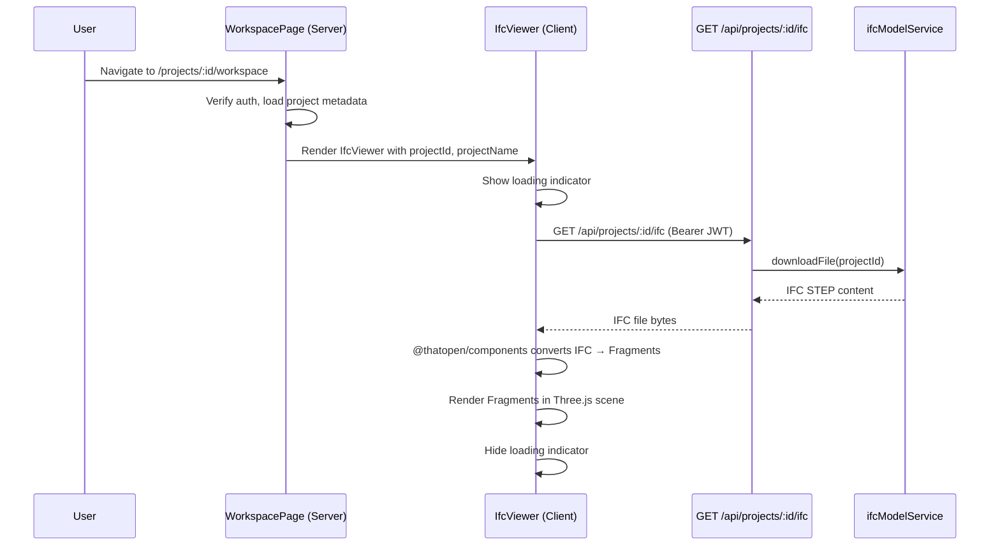
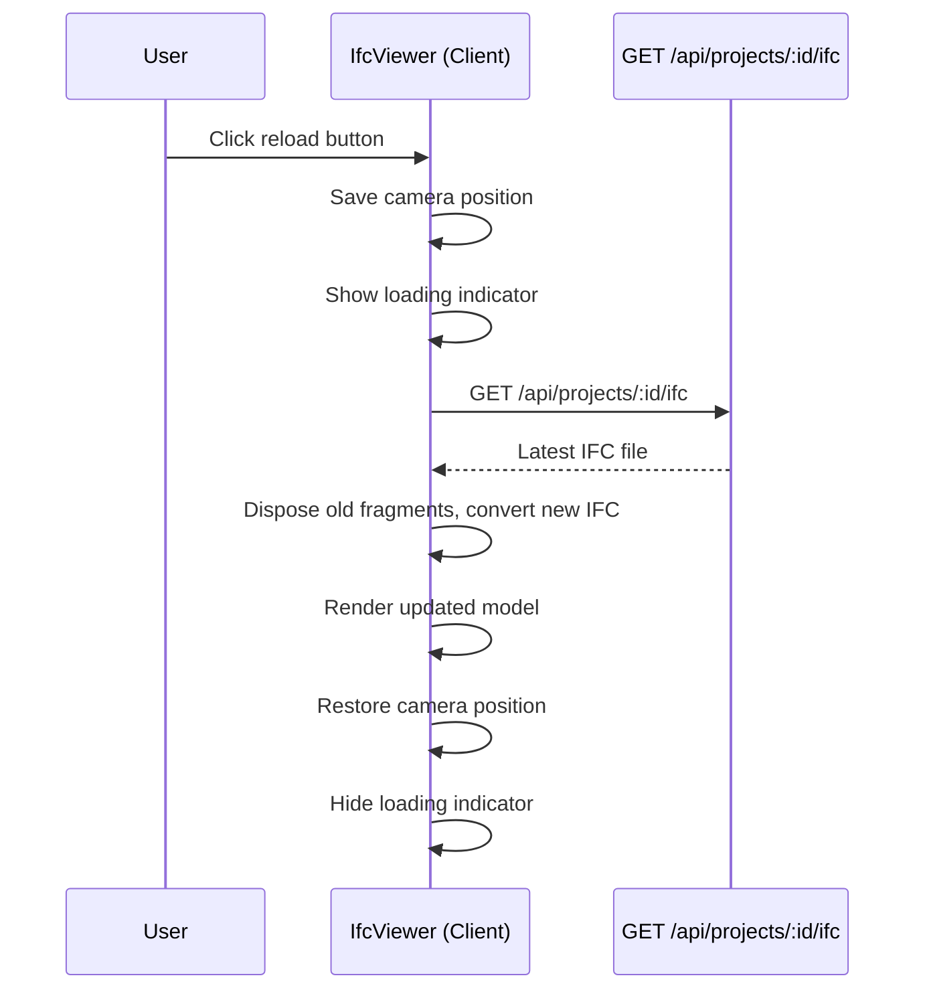

# IFC Viewer — Application Design

## Metadata

| Field            | Value                                                                                     |
|------------------|-------------------------------------------------------------------------------------------|
| **Use Case**     | [UC-USR-017 — View IFC Model in Browser](../../specification/useCases/user/viewIfcModelInBrowser.md) |
| **Feature**      | [F-029 — IFC viewer — load and render model in browser](../../specification/features/ifc/ifcViewer.feature) |
| **UI Mockup**    | [design/ui/ifcWorkspace.html](../ui/ifcWorkspace.html)                                    |
| **Status**       | Approved                                                                                  |
| **Created**      | 2026-03-18                                                                                |
| **Last Updated** | 2026-03-18                                                                                |

## Summary

The workspace page loads the IFC model for a given project, converts it to Fragments client-side using `@thatopen/components`, and renders it in a Three.js-powered 3D viewport. The viewer supports orbit, pan, zoom, camera reset, and model reload. Error and empty-model states are handled with informational overlays.

## Modules & Components

### High-Level Module Map

| Module               | Path                                            | Responsibility                                                    |
|----------------------|-------------------------------------------------|-------------------------------------------------------------------|
| Workspace Page       | `src/app/projects/[projectId]/workspace/page.tsx` | Server component — auth, fetch project metadata, render viewer    |
| Workspace Loading    | `src/app/projects/[projectId]/workspace/loading.tsx` | Skeleton loading state                                       |
| Workspace Error      | `src/app/projects/[projectId]/workspace/error.tsx`   | Error boundary                                               |
| IFC Viewer           | `src/components/ifc/ifcViewer.tsx`              | Client component — 3D viewport, camera controls, model lifecycle  |
| IFC Export UI API    | `src/app/api/projects/[projectId]/ifc/route.ts` | UI API — serves IFC STEP file for authenticated user              |

### Component Hierarchy

```
WorkspacePage (Server)
└── IfcViewer (Client — Three.js canvas, @thatopen/components, state)
    ├── Toolbar (orbit, pan, zoom, reset camera)
    ├── Viewport (Three.js canvas)
    ├── LoadingOverlay (spinner during fetch/conversion)
    ├── ErrorOverlay (fetch error with retry, conversion error with link)
    └── EmptyModelOverlay (no geometry message)
```

## Sequence Diagrams

### Main Flow — Load and Render



### Reload Flow



## Folder Structure

```
src/
  app/
    projects/
      [projectId]/
        workspace/
          page.tsx              # Server component — auth + render viewer
          loading.tsx           # Skeleton loading state
          error.tsx             # Error boundary
    api/
      projects/
        [projectId]/
          ifc/
            route.ts            # GET — serve IFC file for authenticated user
  components/
    ifc/
      ifcViewer.tsx             # Client component — 3D viewer
```

## Data Model

No new types needed. The viewer receives raw IFC STEP bytes from the API and passes them to `@thatopen/components` for conversion.

Props for the viewer component:

```typescript
interface IfcViewerProps {
  projectId: string;
  projectName: string;
  currentVersion: number;
}
```

## API Design

### UI API — Serve IFC File

| Method | Path                            | Request Body | Response                      | Description                            |
|--------|---------------------------------|-------------|-------------------------------|----------------------------------------|
| GET    | `/api/projects/[projectId]/ifc` | —           | IFC STEP file (binary/text)   | Serve latest IFC for authenticated user |

Auth: Supabase JWT via `verifyToken`. Returns 401 if not authenticated, 404 if project not found or not owned by user.

## Error Handling

| Error                    | UI State                                                        |
|-------------------------|-----------------------------------------------------------------|
| Fetch fails (404, 401, network) | Error overlay with "Model could not be loaded" + retry button |
| IFC conversion fails    | Error overlay with "Model could not be processed" + link to projects |
| Empty model (no geometry) | Info overlay with "No visible geometry" message               |
