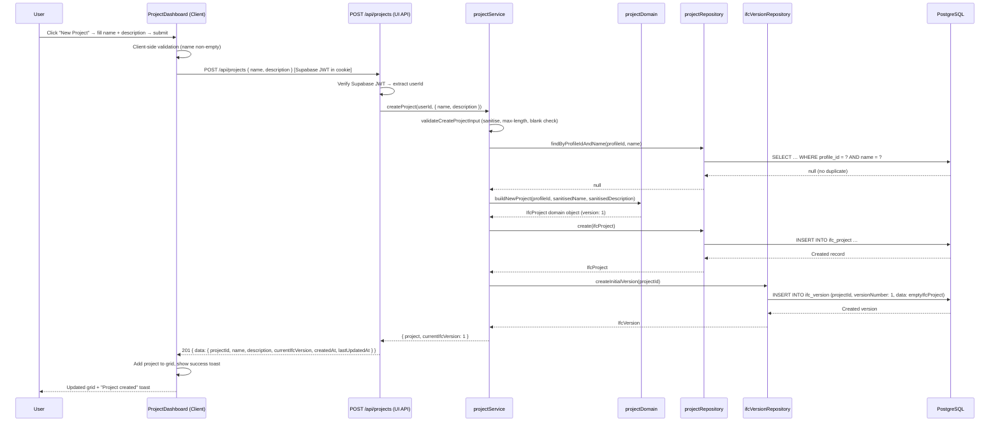
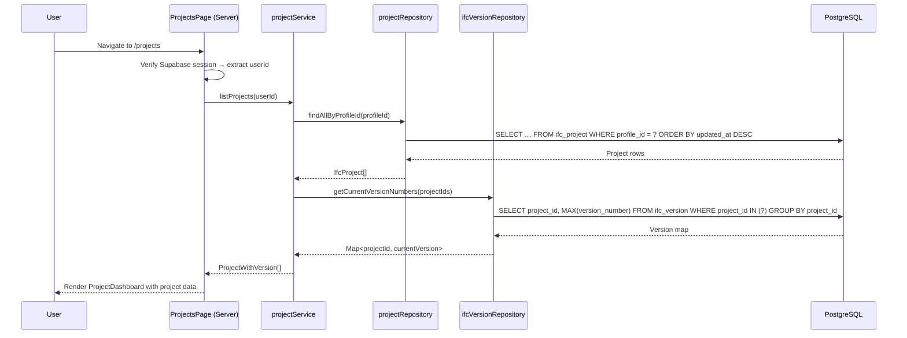
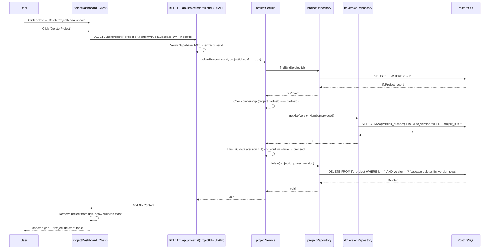
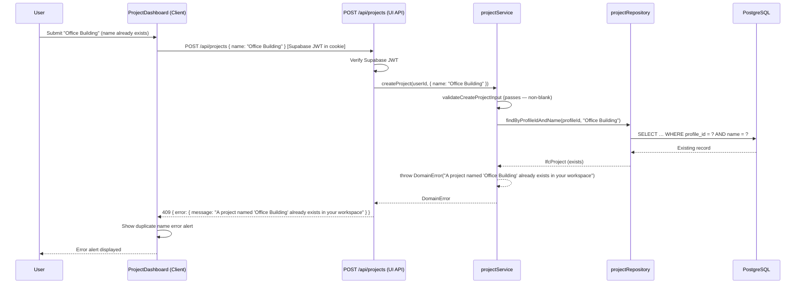

# Manage IFC Projects — Application Design

## Metadata

| Field            | Value                                                                                                         |
|------------------|---------------------------------------------------------------------------------------------------------------|
| **Use Case**     | [UC-USR-016 — Manage IFC Projects](../../specification/useCases/user/manageIfcProjects.md)                    |
| **Feature**      | [F-028 — IFC Project Management](../../specification/features/ifc/ifcProjectManagement.feature)               |
| **UI Mockup**    | [ifcProjects.html](../ui/ifcProjects.html)                                                                    |
| **Status**       | Draft                                                                                                         |
| **Created**      | 2026-03-17                                                                                                    |
| **Last Updated** | 2026-03-17                                                                                                    |

---

## Summary

This feature introduces **IFC projects** as the top-level organisational unit for IFC building models. An authenticated user can create, list, view, rename, and delete projects via a dashboard page and two sets of REST API endpoints. Each project owns exactly one independently versioned IFC model. The project dashboard is a responsive card grid with modals for create/edit/delete operations.

Two API classes are provided over the same `projectService`:

- **UI API** (`/api/projects/...`): called exclusively by the Next.js front-end. Authenticated via the user's Supabase session JWT. No scope enforcement. Returns UI-optimised response shapes.
- **Public REST API** (`/api/v1/projects/...`): called by external consumers and tested by the feature file (`ifcProjectManagement.feature`). Authenticated via OAuth 2.0 Bearer token. Scope enforcement required (`ifc:read`, `ifc:write`, `ifc:delete`). Returns consistent REST envelope.

The UI page fetches data server-side via the same service and renders it through client-side interactive components.

**Internal representation strategy:** The IFC model is stored and manipulated internally as **IFC-JSON** (a JSONB column in the `ifc_version` table). All element queries, mutations, and property edits operate on this JSON representation. Conversion to IFC STEP (`.ifc`), ifcXML, COBie, and other formats happens only at **export time** via the export endpoints defined in F-025. This keeps the working format query-friendly and avoids round-tripping through STEP parsing on every operation.

---

## Modules & Components

### High-Level Module Map

| Module | Path | Responsibility |
|--------|------|----------------|
| Projects page | `src/app/projects/page.tsx` | Server Component — fetches project list, renders shell |
| Projects loading | `src/app/projects/loading.tsx` | Loading UI while page data loads |
| Projects error | `src/app/projects/error.tsx` | Error boundary for the route segment |
| ProjectDashboard | `src/components/ifc/projectDashboard.tsx` | Client Component — orchestrates grid, modals, toasts |
| ProjectCard | `src/components/ifc/projectCard.tsx` | Client Component — individual project card with actions |
| EmptyProjectState | `src/components/ifc/emptyProjectState.tsx` | Client Component — shown when user has no projects |
| ProjectModal | `src/components/ifc/projectModal.tsx` | Client Component — create/edit modal form |
| DeleteProjectModal | `src/components/ifc/deleteProjectModal.tsx` | Client Component — delete confirmation with IFC data warning |
| UI API (list/create) | `src/app/api/projects/route.ts` | `GET` — list projects; `POST` — create project (Supabase JWT) |
| UI API (single) | `src/app/api/projects/[projectId]/route.ts` | `GET` — get project; `PATCH` — update; `DELETE` — delete (Supabase JWT) |
| Public REST API (list/create) | `src/app/api/v1/projects/route.ts` | `GET` — list projects; `POST` — create project (OAuth Bearer + `ifc:read`/`ifc:write`) |
| Public REST API (single) | `src/app/api/v1/projects/[projectId]/route.ts` | `GET`, `PATCH`, `DELETE` (OAuth Bearer + scope) |
| Project service | `src/modules/ifc/projectService.ts` | Application service — validation, orchestration, auth |
| Project domain | `src/modules/ifc/projectDomain.ts` | Pure business rule functions for project data |
| Project repository | `src/modules/ifc/projectRepository.ts` | CRUD + optimistic locking for `ifc_project` table |
| IFC version repository | `src/modules/ifc/ifcVersionRepository.ts` | Insert/query for `ifc_version` table |
| IFC types | `src/modules/ifc/ifcTypes.ts` | Domain types: `IfcProject`, `IfcVersion`, input types |
| Auth helper | `src/lib/apiAuth.ts` | OAuth Bearer token verification (existing) |
| Errors | `src/lib/errors.ts` | Shared error classes (existing) |
| Validation | `src/lib/validation.ts` | Shared sanitisation helpers (existing) |

### Component Hierarchy

```
ProjectsPage (Server)
├── TopNav (Server — existing)
└── ProjectDashboard (Client — "use client")
    ├── Page header with "New Project" button
    ├── Error alert (duplicate name)
    ├── EmptyProjectState (Client)
    │   └── "Create my first project" button
    ├── Project grid
    │   ├── ProjectCard (Client) × N
    │   │   ├── Project icon
    │   │   ├── Edit button → opens ProjectModal
    │   │   ├── Delete button → opens DeleteProjectModal
    │   │   ├── Project name, description, lastUpdatedAt, version badge
    │   │   └── "Open Workspace" link → /projects/{projectId}/workspace
    │   └── "New project" placeholder card
    ├── ProjectModal (Client)
    │   ├── Name input (required)
    │   ├── Description textarea (optional)
    │   ├── Validation error alert
    │   └── Cancel / Create|Save buttons
    ├── DeleteProjectModal (Client)
    │   ├── Warning icon + title
    │   ├── IFC data warning (conditional — shown when project has versions > 1)
    │   ├── Confirmation text with project name
    │   └── Cancel / Delete buttons
    └── Toast notification (success)
```

---

## Sequence Diagrams

### Create Project — Main Flow



> **Note:** The Public REST flow (`POST /api/v1/projects`) follows the same service path but replaces Supabase JWT verification with OAuth Bearer token + `ifc:write` scope enforcement.

### List Projects — Alternative Flow



### Delete Project With Confirmation — Exception Flow



### Duplicate Name — Error Flow



---

## Folder Structure

```
src/
  app/
    projects/
      page.tsx                          # Server Component — project list page
      loading.tsx                       # Loading state
      error.tsx                         # Error boundary ("use client")
    api/
      projects/
        route.ts                        # UI API: GET (list), POST (create) — Supabase JWT
        [projectId]/
          route.ts                      # UI API: GET, PATCH, DELETE — Supabase JWT
    api/v1/
      projects/
        route.ts                        # Public REST: GET (ifc:read), POST (ifc:write)
        [projectId]/
          route.ts                      # Public REST: GET (ifc:read), PATCH (ifc:write), DELETE (ifc:delete)
  components/
    ifc/
      projectDashboard.tsx              # Client — orchestrator: grid + modals + toasts
      projectCard.tsx                   # Client — single project card
      emptyProjectState.tsx             # Client — empty state UI
      projectModal.tsx                  # Client — create/edit project modal
      deleteProjectModal.tsx            # Client — delete confirmation modal
  modules/
    ifc/
      projectService.ts                # Application service
      projectDomain.ts                 # Pure domain logic
      projectRepository.ts             # ifc_project table CRUD
      ifcVersionRepository.ts          # ifc_version table access
      ifcTypes.ts                      # Domain types
```

---

## Data Model

### Domain Types

```typescript
// src/modules/ifc/ifcTypes.ts

export interface IfcProject {
  id: string;
  profileId: string;
  name: string;
  description: string | null;
  version: number;
  createdAt: Date;
  updatedAt: Date;  // corresponds to "lastUpdatedAt" in the use case
}

export interface IfcVersion {
  id: string;
  projectId: string;
  versionNumber: number;
  data: IfcModelData;
  createdAt: Date;
}

/** The IFC-JSON object stored in the ifc_version.data JSONB column. */
export interface IfcModelData {
  type: string;           // "ifcJSON"
  version: string;
  data: unknown[];        // IFC entities
}

export interface ProjectWithVersion {
  project: IfcProject;
  currentIfcVersion: number;
}

export interface CreateProjectInput {
  name: string;
  description?: string;
}

export interface UpdateProjectInput {
  name?: string;
  description?: string;
}
```

### API Response Shapes

Both API classes return the same shape since `projectService` provides the data in both cases. UI API responses may include additional UI-computed fields in future.

```typescript
// POST /api/projects  (UI API)  or  POST /api/v1/projects  (Public REST) — 201 Created
{
  data: {
    projectId: string;
    name: string;
    description: string | null;
    currentIfcVersion: number;
    createdAt: string;        // ISO 8601
    lastUpdatedAt: string;    // ISO 8601
  }
}

// GET /api/projects  (UI API)  or  GET /api/v1/projects  (Public REST) — 200 OK
{
  data: {
    projects: Array<{
      projectId: string;
      name: string;
      description: string | null;
      currentIfcVersion: number;
      createdAt: string;
      lastUpdatedAt: string;
    }>;
  }
}

// GET /api/projects/{id}  (UI API)  or  GET /api/v1/projects/{id}  (Public REST) — 200 OK
{
  data: {
    projectId: string;
    name: string;
    description: string | null;
    currentIfcVersion: number;
    createdAt: string;
    lastUpdatedAt: string;
  }
}

// PATCH /api/projects/{id}  (UI API)  or  PATCH /api/v1/projects/{id}  (Public REST) — 200 OK
{
  data: {
    projectId: string;
    name: string;
    description: string | null;
    currentIfcVersion: number;
    createdAt: string;
    lastUpdatedAt: string;
  }
}

// DELETE /api/projects/{id}?confirm=true  or  DELETE /api/v1/projects/{id}?confirm=true — 204 No Content
// (no body)
```

### Error Response Shapes

```typescript
// 409 — Duplicate project name
{ error: { message: "A project named 'Office Building' already exists in your workspace" } }

// 422 — Blank name
{ error: { message: "Project name is required" } }

// 404 — Project not found (or belongs to another user)
{ error: { message: "Project not found" } }

// 409 — Delete without confirm flag
{ error: { message: "Project contains IFC data; add ?confirm=true to the request to permanently delete it" } }

// 401 — Missing or invalid token
{ error: { message: "Authentication required." } }

// 403 — Insufficient scope
{ error: { message: "Insufficient scope; required: ifc:write" } }
```

---

## API Design

### UI API — `/api/projects/` (Supabase JWT, no scope enforcement)

| Method | Path | Request Body | Response | Description |
|--------|------|-------------|----------|-------------|
| POST | `/api/projects` | `{ name: string, description?: string }` | `201` — project data | Create a new project with an empty IFC model at v1 |
| GET | `/api/projects` | — | `200` — projects array | List all projects owned by the user, ordered by `lastUpdatedAt` desc |
| GET | `/api/projects/{projectId}` | — | `200` — project data | Get a single project's metadata |
| PATCH | `/api/projects/{projectId}` | `{ name?: string, description?: string }` | `200` — updated project data | Update project name and/or description |
| DELETE | `/api/projects/{projectId}` | — | `204` — no content | Delete project; requires `?confirm=true` if project has IFC data (version > 1) |

### Public REST API — `/api/v1/projects/` (OAuth 2.0 Bearer + scope)

| Method | Path | Scopes Required | Request Body | Response | Description |
|--------|------|-----------------|-------------|----------|-------------|
| POST | `/api/v1/projects` | `ifc:write` | `{ name: string, description?: string }` | `201` — project data | Create a new project with an empty IFC model at v1 |
| GET | `/api/v1/projects` | `ifc:read` | — | `200` — projects array | List all projects owned by the token holder, ordered by `lastUpdatedAt` desc |
| GET | `/api/v1/projects/{projectId}` | `ifc:read` | — | `200` — project data | Get a single project's metadata |
| PATCH | `/api/v1/projects/{projectId}` | `ifc:write` | `{ name?: string, description?: string }` | `200` — updated project data | Update project name and/or description |
| DELETE | `/api/v1/projects/{projectId}` | `ifc:delete` | — | `204` — no content | Delete project; requires `?confirm=true` if project has IFC data (version > 1) |

### Route Handler Implementation Pattern

Route handlers are thin adapters. Both API classes delegate to the same `projectService`:

**UI API** (`/api/projects/`, Supabase JWT):
```
1. Verify Supabase JWT → extract userId
2. Parse and pass raw input to projectService
3. Map result to response envelope ({ data: ... })
4. Map errors to HTTP status codes (same as Public REST below)
```

**Public REST API** (`/api/v1/projects/`, OAuth Bearer):
```
1. Verify Bearer token → extract userId, scopes (via verifyTokenAndScope)
2. Check required scope (ifc:read / ifc:write / ifc:delete)
3. Parse and pass raw input to projectService
4. Map result to response envelope ({ data: ... })
5. Map errors to HTTP status codes:
   - ValidationError → 422
   - DomainError (duplicate name) → 409
   - DomainError (delete without confirm) → 409
   - NotFoundError → 404
   - ConcurrencyError → 409
   - AuthorisationError → 401
   - ForbiddenError (scope) → 403
   - Unhandled → 500
```

Note: The use case specifies `422` for blank name and `409` for duplicate name. The standard error mapping from `applicationService.instructions.md` is used for all others.

---

## Persistence Dependencies

| Table | Access | Purpose |
|-------|--------|---------|
| `profile` | Read | Resolve the `profileId` from the authenticated `supabaseUserId` |
| `ifc_project` | Read / Write | Store project metadata (name, description, timestamps) |
| `ifc_version` | Read / Write | Store immutable IFC model snapshots; insert v1 on project creation; query for current version number |

The `ifc_project` and `ifc_version` tables are defined in `./design/database/schema.md` (change log entry 2026-03-16). The Prisma schema already includes `IfcProject` and `IfcVersion` models. No additional schema changes are needed for this feature.

### Repository Methods

**projectRepository.ts** (`ifc_project` table):

| Method | Signature | Notes |
|--------|-----------|-------|
| `findById` | `(id: string) => Promise<IfcProject \| null>` | Standard lookup |
| `findAllByProfileId` | `(profileId: string) => Promise<IfcProject[]>` | Ordered by `updatedAt` desc |
| `findByProfileIdAndName` | `(profileId: string, name: string) => Promise<IfcProject \| null>` | Used for duplicate check |
| `create` | `(data: CreateProjectData) => Promise<IfcProject>` | Insert new project |
| `update` | `(id: string, data: UpdateProjectData, expectedVersion: number) => Promise<IfcProject>` | Optimistic locking update |
| `delete` | `(id: string, expectedVersion: number) => Promise<void>` | Optimistic locking delete; cascade deletes `ifc_version` rows |

**ifcVersionRepository.ts** (`ifc_version` table):

| Method | Signature | Notes |
|--------|-----------|-------|
| `createInitialVersion` | `(projectId: string) => Promise<IfcVersion>` | Insert version 1 with empty IfcProject JSON |
| `getMaxVersionNumber` | `(projectId: string) => Promise<number>` | `SELECT MAX(version_number)` for delete-confirm check |
| `getCurrentVersionNumbers` | `(projectIds: string[]) => Promise<Map<string, number>>` | Batch query for project list |

---

## State Management

The `ProjectDashboard` client component manages all interactive state:

### State Variables

| State | Type | Initial | Purpose |
|-------|------|---------|---------|
| `projects` | `ProjectWithVersion[]` | Server-provided via props | The list of projects displayed in the grid |
| `modalMode` | `'create' \| 'edit' \| null` | `null` | Controls which modal is shown |
| `editingProject` | `ProjectWithVersion \| null` | `null` | The project being edited (pre-fills modal fields) |
| `deleteTarget` | `ProjectWithVersion \| null` | `null` | The project pending deletion |
| `toast` | `{ message: string } \| null` | `null` | Success toast message (auto-dismissed after 3s) |
| `pageError` | `string \| null` | `null` | Page-level error (e.g. duplicate name from create) |

### State Transitions

```
Idle (grid displayed)
  │
  ├── Click "New Project" → modalMode: 'create'
  │     ├── Submit (success) → add to projects, close modal, show toast
  │     ├── Submit (409 duplicate) → show error in modal
  │     ├── Submit (422 blank) → show error in modal
  │     └── Cancel → modalMode: null
  │
  ├── Click Edit → modalMode: 'edit', editingProject: selected
  │     ├── Submit (success) → update project in list, close modal, show toast
  │     └── Cancel → modalMode: null
  │
  ├── Click Delete → deleteTarget: selected
  │     ├── Confirm → delete from projects, close modal, show toast
  │     ├── Confirm (409 no flag) → should not happen (UI always sends confirm=true)
  │     └── Cancel → deleteTarget: null
  │
  └── Click "Open Workspace" → navigate to /projects/{projectId}/workspace
```

### Toast Auto-Dismiss

The success toast is shown for 3 seconds and then automatically hidden via `setTimeout`. This matches the behaviour shown in the HTML mockup.

---

## Authentication & Authorisation

### Auth Method

This feature uses both auth mechanisms:

- **Supabase session JWT** — used by the Next.js page and UI API. The Supabase server SDK extracts the user from the session cookie.
- **OAuth 2.0 Bearer token** — used by the Public REST API. `verifyTokenAndScope()` in `src/modules/auth/authService.ts` validates the token and checks scopes.

### Protected Routes

| Route | Auth Method | Protected By |
|-------|------------|------|
| `/projects` (page) | Supabase session cookie | Next.js middleware (`src/middleware.ts`) |
| `GET/POST /api/projects` | Supabase session JWT | `supabase.auth.getUser()` in route handler |
| `GET/PATCH/DELETE /api/projects/[projectId]` | Supabase session JWT | `supabase.auth.getUser()` in route handler |
| `GET/POST /api/v1/projects` | OAuth 2.0 Bearer + scope | `verifyTokenAndScope()` in route handler |
| `GET/PATCH/DELETE /api/v1/projects/[projectId]` | OAuth 2.0 Bearer + scope | `verifyTokenAndScope()` in route handler |

### Middleware Update

The existing `src/middleware.ts` must be updated to add `/projects` to the `PROTECTED_PREFIXES` array so unauthenticated users are redirected to `/login`.

### Scope Enforcement

Each API endpoint checks the required OAuth scope before proceeding:

| Operation | Required Scope |
|-----------|---------------|
| List projects, get project | `ifc:read` |
| Create project, update project | `ifc:write` |
| Delete project | `ifc:delete` |

### Ownership Rule

Users may only access their own projects. The project service checks `project.profileId === profile.id` for every operation. If a user attempts to access another user's project, the service throws `NotFoundError("Project not found")` — not `AuthorisationError` — to avoid confirming existence (per UC-USR-016 business rules).

---

## Secrets & Environment Variables

This feature does not introduce any new environment variables or secrets. It relies on the existing:

| Variable | Purpose | Server / Client |
|----------|---------|-----------------|
| `SUPABASE_URL` | Supabase project URL | Server only |
| `SUPABASE_ANON_KEY` | Supabase anonymous key | Server only |
| `SUPABASE_SERVICE_ROLE_KEY` | Supabase service role key (for server-side auth) | Server only |
| `DATABASE_URL` | PostgreSQL connection string (Prisma) | Server only |

No `NEXT_PUBLIC_` variables are needed for this feature. All project data is fetched server-side or via authenticated API calls.

---

## External Dependencies & Integrations

This feature has **no external service dependencies**. All data is stored in and read from the application's PostgreSQL database via Prisma. No third-party APIs, AI/vision services, or external libraries are needed beyond what is already in the project.

---

## Business Rules Implementation

| # | Business Rule | Module | Implementation Notes |
|---|---------------|--------|---------------------|
| 1 | Project names must be unique within a user's workspace | `projectService.ts` | Query `projectRepository.findByProfileIdAndName()` before create/update; throw `DomainError` on duplicate |
| 2 | Project names must not be blank | `projectService.ts` | `validateCreateProjectInput` / `validateUpdateProjectInput` — trim and check non-empty; throw `ValidationError` |
| 3 | Each project holds exactly one IFC model | `projectService.ts` + `ifcVersionRepository.ts` | On create, insert a single initial `ifc_version` row (v1) with an empty `IfcProject` entity in the same transaction |
| 4 | IFC version counter starts at 1 and increments per mutation, independently per project | `ifcVersionRepository.ts` | `createInitialVersion` inserts `versionNumber: 1`; mutations (covered by other features) append `MAX(version_number) + 1` |
| 5 | Updating project metadata does not create a new IFC version | `projectService.ts` | `updateProject` only calls `projectRepository.update()` — never touches `ifc_version` |
| 6 | `createdAt` is immutable — never updated after creation | `projectRepository.ts` | `update` method does not include `createdAt` in the Prisma update payload; Prisma only writes `updatedAt` |
| 7 | `lastUpdatedAt` (mapped to `updatedAt`) updates only on metadata changes | `projectRepository.ts` | Prisma's `@updatedAt` auto-sets on update; IFC mutations (other features) do not touch `ifc_project.updatedAt` |
| 8 | Users can only access their own projects | `projectService.ts` | All service methods resolve `profileId` from the authenticated user, then check `project.profileId === profileId`; mismatch throws `NotFoundError` (not `AuthorisationError`) |
| 9 | Accessing another user's project returns 404 (not 403) | `projectService.ts` | Ownership check throws `NotFoundError("Project not found")` to avoid confirming existence |
| 10 | Delete requires `?confirm=true` when project has IFC data | `projectService.ts` | Check `maxVersionNumber > 1`; if true and `confirm !== true`, throw `DomainError` with the specific error message |
| 11 | Two different users may have projects with the same name | Database constraint | `UNIQUE(profileId, name)` on `ifc_project` — allows duplicate names across users, prevents within a user |
| 12 | Project name max 255 characters | `projectService.ts` | `sanitiseString(input.name, 255)` in validation |

---

## Error Handling Strategy

| Exception | Detection Point | HTTP Status | User Feedback | Technical Detail |
|-----------|----------------|-------------|---------------|-----------------|
| Blank project name | `projectService` — `validateCreateProjectInput` / `validateUpdateProjectInput` | `422` | Modal inline error: "Project name is required" | `ValidationError("Project name is required")` |
| Duplicate project name | `projectService` — `findByProfileIdAndName` returns existing | `409` | Page-level error alert: "A project named '{name}' already exists in your workspace" | `DomainError` with interpolated message |
| Project not found (or another user's) | `projectService` — `findById` returns null or ownership mismatch | `404` | "Project not found" | `NotFoundError("Project not found")` |
| Delete without confirm flag when project has IFC data | `projectService` — `maxVersionNumber > 1` and `confirm !== true` | `409` | Not shown in UI (UI always sends `confirm=true`) | `DomainError("Project contains IFC data; add ?confirm=true to the request to permanently delete it")` |
| Optimistic locking conflict | `projectRepository` — version mismatch on update/delete | `409` | "This project was modified by another session. Please refresh and try again." | `ConcurrencyError` propagated from repository |
| Missing or invalid OAuth token | Route handler — `verifyBearerToken` returns null | `401` | — (API consumer sees 401) | `unauthorized()` response helper |
| Insufficient OAuth scope | Route handler — `hasScope` returns false | `403` | — (API consumer sees 403) | `forbidden("Insufficient scope; required: ifc:write")` |
| Unexpected server error | Route handler — catch-all | `500` | "An unexpected error occurred." | `internalError()` response helper; error logged server-side |

---

## Assumptions & Constraints

- The `ifc_project` and `ifc_version` tables defined in `schema.md` are approved and present in the Prisma schema before implementation begins.
- **IFC-JSON is the internal working format.** The `ifc_version.data` JSONB column stores the full model as IFC-JSON. All element-level operations (create, update, delete, query) work directly on this JSON. Export to IFC STEP and other formats (F-025) is a conversion performed on demand — the system never stores or operates on STEP-encoded data internally.
- The project list page does not support pagination in the initial implementation. The use case mentions pagination support; this can be added as a follow-up if the number of projects per user grows large enough to warrant it.
- The "Open Workspace" link on each project card navigates to `/projects/{projectId}/workspace`, which is the route for the IFC viewer (UC-USR-017). That page is designed separately.
- The empty IFC model JSON for version 1 is a minimal valid IFC-JSON object containing only a root `IfcProject` entity. Its exact structure will be defined during implementation of the IFC file management features (F-015).
- The project dashboard shows a relative timestamp for `lastUpdatedAt` (e.g. "Updated 2 hours ago"). This is computed client-side from the ISO timestamp.
- Project card icon colours alternate or are derived from the project — this is a cosmetic detail handled in the component, not a business rule.

---

## Open Questions

- [ ] Should the project list page support pagination from the start, or is an unpaginated list acceptable for MVP? The use case mentions pagination; the mockup does not show pagination controls.
- [ ] What is the exact structure of the empty IFC-JSON document for the initial version 1 snapshot? This will be defined alongside F-015 (IFC file management) but is needed for the initial project creation transaction.
- [ ] Should the project creation and initial version insert be wrapped in a single Prisma `$transaction`, or is the cascading delete sufficient to handle partial failures? (Recommended: use a transaction to guarantee atomicity.)

---

## Notes

- This design covers only the project management CRUD and the project dashboard UI. The IFC model operations within a project (element creation, versioning, viewer, etc.) are separate features under UC-USR-015, UC-USR-017, and UC-USR-018 and will have their own application designs.
- The `/api/projects/{projectId}/ifc/...` route prefix for nested IFC operations (referenced in S-207, S-208) is not defined in this design — it belongs to the IFC API design. This design only defines the `/api/projects/...` routes for project metadata management.
- The route handler for `DELETE` must read the `confirm` query parameter from the URL search params (`request.nextUrl.searchParams.get('confirm')`).
