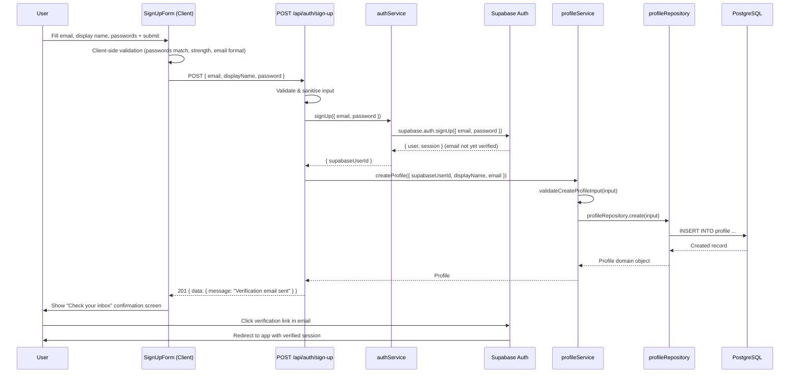
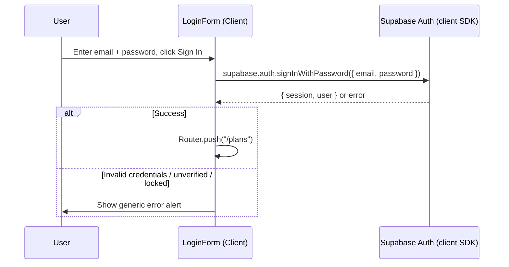
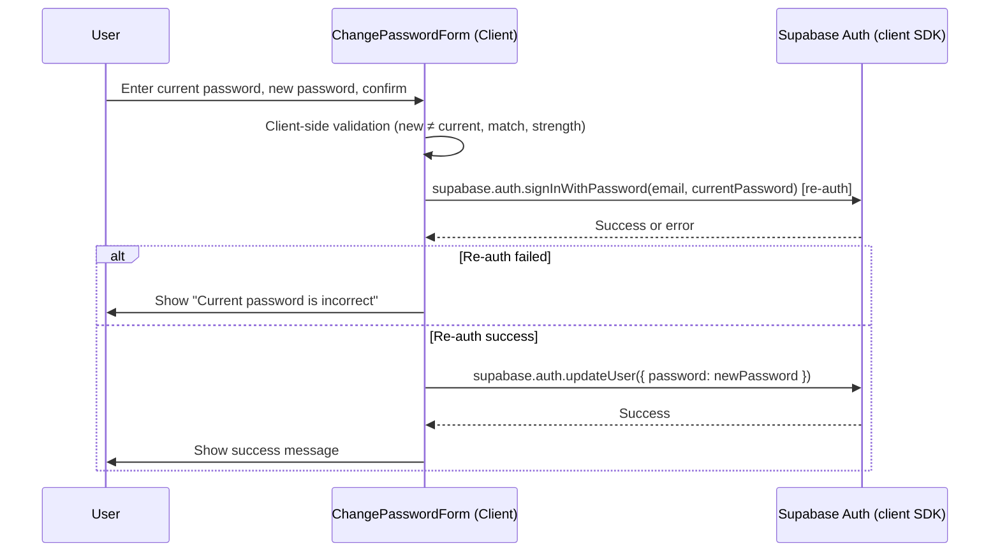
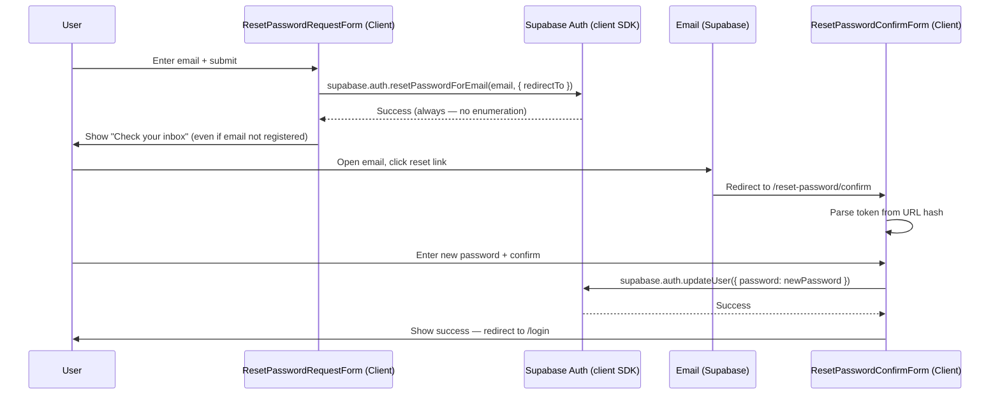

# User Authentication — Application Design

## Metadata

| Field            | Value                                                                                                         |
|------------------|---------------------------------------------------------------------------------------------------------------|
| **Use Cases**    | [UC-USR-003 Sign Up](../../specification/useCases/user/signUp.md)                                             |
|                  | [UC-USR-004 Login](../../specification/useCases/user/login.md)                                                |
|                  | [UC-USR-005 Logout](../../specification/useCases/user/logout.md)                                              |
|                  | [UC-USR-006 Change Password](../../specification/useCases/user/changePassword.md)                             |
|                  | [UC-USR-007 Reset Password](../../specification/useCases/user/resetPassword.md)                               |
|                  | [UC-USR-008 Change Email Address](../../specification/useCases/user/changeEmailAddress.md)                    |
| **Features**     | [F-002 Sign Up](../../specification/features/authentication/signUp.feature)                                   |
|                  | [F-003 Login](../../specification/features/authentication/login.feature)                                      |
|                  | [F-004 Logout](../../specification/features/authentication/logout.feature)                                    |
|                  | [F-005 Change Password](../../specification/features/authentication/changePassword.feature)                   |
|                  | [F-006 Reset Password](../../specification/features/authentication/resetPassword.feature)                     |
|                  | [F-007 Change Email Address](../../specification/features/authentication/changeEmailAddress.feature)          |
| **UI Mockups**   | [signUp.html](../ui/signUp.html), [login.html](../ui/login.html), [logout.html](../ui/logout.html)            |
|                  | [changePassword.html](../ui/changePassword.html), [resetPassword.html](../ui/resetPassword.html)              |
|                  | [changeEmailAddress.html](../ui/changeEmailAddress.html)                                                      |
| **Status**       | Draft                                                                                                         |
| **Created**      | 2026-05-25                                                                                                    |
| **Last Updated** | 2026-05-25                                                                                                    |

---

## Summary

Authentication is delegated entirely to **Supabase Auth** (email/password strategy). Supabase owns credential storage, email verification, password reset tokens, and session JWT issuance. The application's responsibility is to:

1. Provide UI forms that call Supabase client-side Auth methods.
2. Create an application `profile` record after successful sign-up.
3. Verify Supabase JWTs server-side on protected API routes.
4. Keep the application `profile.email` in sync when the user changes their email address.

No custom credential logic, token generation, or session management is implemented — Supabase handles all of that.

---

## Modules & Components

### High-Level Module Map

| Module | Path | Responsibility |
|--------|------|----------------|
| Sign-up page | `src/app/(auth)/sign-up/page.tsx` | Server Component shell for the sign-up screen |
| Login page | `src/app/(auth)/login/page.tsx` | Server Component shell for the login screen |
| Logout page | `src/app/(auth)/logout/page.tsx` | Server Component — server action performs sign-out |
| Change password page | `src/app/(auth)/change-password/page.tsx` | Protected Client Component shell |
| Reset password (request) page | `src/app/(auth)/reset-password/page.tsx` | Server Component shell |
| Reset password (set new) page | `src/app/(auth)/reset-password/confirm/page.tsx` | Client Component — reads token from URL hash |
| Change email page | `src/app/(auth)/change-email/page.tsx` | Protected Client Component shell |
| SignUpForm | `src/components/auth/signUpForm.tsx` | Client Component — email, display name, password fields + submit |
| LoginForm | `src/components/auth/loginForm.tsx` | Client Component — email, password fields + submit |
| ChangePasswordForm | `src/components/auth/changePasswordForm.tsx` | Client Component — current + new + confirm fields |
| ResetPasswordRequestForm | `src/components/auth/resetPasswordRequestForm.tsx` | Client Component — email field |
| ResetPasswordConfirmForm | `src/components/auth/resetPasswordConfirmForm.tsx` | Client Component — new + confirm fields |
| ChangeEmailForm | `src/components/auth/changeEmailForm.tsx` | Client Component — new email + password (re-auth) |
| Sign-up API route | `src/app/api/auth/sign-up/route.ts` | `POST` — calls `authService.signUp`, creates profile |
| Auth service | `src/modules/auth/authService.ts` | Supabase sign-up, JWT verification, token helpers |
| Profile service | `src/modules/profile/profileService.ts` | Create / update / fetch application profile |
| Profile repository | `src/modules/profile/profileRepository.ts` | CRUD for `profile` table with optimistic locking |
| Profile domain | `src/modules/profile/profileDomain.ts` | Pure business rule functions for profile data |
| Profile types | `src/modules/profile/profileTypes.ts` | `Profile`, `CreateProfileInput`, `UpdateProfileInput` |
| Supabase browser client | `src/lib/supabase/browserClient.ts` | Singleton Supabase client for Client Components |
| Supabase server client | `src/lib/supabase/serverClient.ts` | Supabase client for Server Components and API routes |
| Auth middleware | `src/middleware.ts` | Protects `/plans` and `/account` routes; redirects unauthenticated users to `/login` |
| Errors | `src/lib/errors.ts` | `ValidationError`, `DomainError`, `NotFoundError`, `ConcurrencyError`, `AuthorisationError` |
| Validation | `src/lib/validation.ts` | Shared sanitisation helpers |
| Env | `src/lib/env.ts` | Validated environment variable access |

### Component Hierarchy — Sign Up

```
SignUpPage (Server)
└── SignUpForm (Client — "use client")
    ├── Email input
    ├── Display name input
    ├── Password input (with show/hide toggle)
    ├── Confirm password input (with show/hide toggle)
    ├── Password strength indicator
    ├── Submit button
    └── Inline error alerts (email taken, mismatch, weak password, invalid email)
```

### Component Hierarchy — Login

```
LoginPage (Server)
└── LoginForm (Client — "use client")
    ├── Email input
    ├── Password input (with show/hide toggle)
    ├── Remember me checkbox
    ├── Submit button
    ├── Forgot password link → /reset-password
    └── Error alert (generic "invalid credentials" — no enumeration)
```

---

## Sequence Diagrams

### Sign Up — Main Flow



### Login — Main Flow



Login is handled entirely client-side via the Supabase browser SDK. No custom API route is required — Supabase issues and manages the JWT.

### Change Password — Main Flow



### Reset Password — Main Flow



---

## Folder Structure

```
src/
  app/
    (auth)/
      sign-up/
        page.tsx                          # Sign-up page shell (Server Component)
      login/
        page.tsx                          # Login page shell (Server Component)
      logout/
        page.tsx                          # Logout (Server Action)
      change-password/
        page.tsx                          # Change password page (protected)
      reset-password/
        page.tsx                          # Request reset link page
        confirm/
          page.tsx                        # Set new password page (reads URL hash)
      change-email/
        page.tsx                          # Change email page (protected)
    api/
      auth/
        sign-up/
          route.ts                        # POST — create Supabase user + profile
  components/
    auth/
      signUpForm.tsx                      # Client Component
      loginForm.tsx                       # Client Component
      changePasswordForm.tsx              # Client Component
      resetPasswordRequestForm.tsx        # Client Component
      resetPasswordConfirmForm.tsx        # Client Component
      changeEmailForm.tsx                 # Client Component
  lib/
    supabase/
      browserClient.ts                    # Supabase browser singleton
      serverClient.ts                     # Supabase server singleton
    errors.ts                             # Shared error classes
    validation.ts                         # Shared sanitisation helpers (extend existing)
    env.ts                                # Env var access (extend existing)
  middleware.ts                           # Route protection
  modules/
    auth/
      authService.ts                      # signUp(), verifyToken()
    profile/
      profileDomain.ts                    # Pure functions: validateDisplayName(), updateEmail()
      profileService.ts                   # createProfile(), updateProfileEmail()
      profileRepository.ts               # CRUD + optimistic locking for profile table
      profileTypes.ts                     # Profile, CreateProfileInput, UpdateProfileInput
      __tests__/
        profileDomain.test.ts
        profileService.test.ts
        profileRepository.integration.test.ts
prisma/
  schema.prisma                           # Prisma schema (profile + reference_data)
  seed.ts                                 # Reference data seed
```

---

## Data Model

```typescript
// src/modules/profile/profileTypes.ts

export interface Profile {
  id: string;
  supabaseUserId: string;
  displayName: string;
  email: string;
  version: number;
  createdAt: Date;
  updatedAt: Date;
}

export interface CreateProfileInput {
  supabaseUserId: string;
  displayName: string;
  email: string;
}

export interface UpdateProfileInput {
  displayName?: string;
  email?: string;
}
```

---

## API Design

| Method | Path | Auth | Request Body | Response | Description |
|--------|------|------|--------------|----------|-------------|
| POST | `/api/auth/sign-up` | None | `{ email, displayName, password }` | `{ data: { message } }` | Create Supabase user + profile |

> All other auth operations (login, logout, password change, reset, email change) use the Supabase client SDK directly — no custom API routes are needed.

### Request / Response Detail

**POST `/api/auth/sign-up`**

```typescript
// Request body
{
  email: string;        // Max 254 chars, valid email format
  displayName: string;  // Max 100 chars, non-empty, stripped of HTML
  password: string;     // Min 8 chars, at least one uppercase, one digit, one special char
}

// 201 — Success
{ data: { message: "Verification email sent. Please check your inbox." } }

// 400 — Validation failure
{ error: { message: "Password too weak", code: "WEAK_PASSWORD" } }
{ error: { message: "Invalid email format", code: "INVALID_EMAIL" } }
{ error: { message: "Passwords do not match", code: "PASSWORDS_MISMATCH" } }

// 409 — Email already registered
{ error: { message: "An account with this email already exists.", code: "EMAIL_TAKEN" } }

// 500 — Unexpected error
{ error: { message: "Internal server error" } }
```

---

## Persistence Dependencies

| Table | Access | Purpose |
|-------|--------|---------|
| `profile` | Create / Update / Read | Application identity linked to Supabase user; created on sign-up, updated on email change |
| `reference_data` | Read | (No auth use, reserved for future role lookups) |

Schema changes required: See [design/database/schema.md](../database/schema.md) — `profile` and `reference_data` tables (awaiting approval).

---

## State Management

### Sign-Up Form State

| State | Trigger |
|-------|---------|
| `idle` | Page load |
| `submitting` | Form submitted, awaiting API response |
| `verification-sent` | API returned 201 — show "check inbox" screen |
| `error` | API returned 4xx — show inline field / alert error |

State is held in the `SignUpForm` Client Component using `useState`. No global state is required.

### Login Session State

User session is managed entirely by Supabase (JWT stored in `localStorage` / `sessionStorage`). The application reads it via `supabase.auth.getSession()` in Client Components or server-side via the service role client.

### Protected Route State

Next.js middleware reads the Supabase session cookie / bearer token and redirects unauthenticated access to `/login`.

---

## Authentication & Authorisation

- **Auth method** — Supabase email/password. JWT issued by Supabase on successful login. Client SDK manages token refresh.
- **Protected routes** — `/plans`, `/account/*`, `/change-password`, `/change-email`. Enforced by `src/middleware.ts`.
- **Middleware** — Next.js `middleware.ts` matches the protected route pattern, calls `supabase.auth.getSession()` (server-side), and redirects to `/login` if no valid session.
- **Authorisation rules** — Any authenticated user can access their own profile data. No role-based access for the MVP.

---

## Secrets & Environment Variables

| Variable | Purpose | Server / Client | Example |
|----------|---------|-----------------|---------|
| `NEXT_PUBLIC_SUPABASE_URL` | Supabase project URL | Client | `https://xyz.supabase.co` |
| `NEXT_PUBLIC_SUPABASE_ANON_KEY` | Supabase public anon key | Client | `eyJ...` |
| `SUPABASE_SERVICE_ROLE_KEY` | Server-side auth verification / admin ops | Server only | `eyJ...` |
| `DATABASE_URL` | Prisma PostgreSQL connection string | Server only | `postgresql://...` |

All server-only variables are accessed via `src/lib/env.ts` (throws at startup if missing). Client variables are prefixed `NEXT_PUBLIC_`.

---

## External Dependencies & Integrations

| Dependency | Purpose | Type |
|------------|---------|------|
| `@supabase/supabase-js` | Auth SDK (sign-up, sign-in, JWT, email flows) | npm package |
| Supabase Auth service | Email verification, password reset, session JWT | External service |
| Supabase PostgreSQL | Application database via Prisma | External service |
| `@prisma/client` | Database ORM for `profile` CRUD | npm package |

**Error handling:** Supabase SDK errors are caught in the service layer and mapped to application error classes (`ValidationError`, `AuthorisationError`). If Supabase is unreachable, the API route returns `503 Service Unavailable`.

---

## Business Rules Implementation

| Business Rule | Module | Implementation Notes |
|---------------|--------|---------------------|
| Email must be unique | Supabase Auth | Supabase enforces uniqueness; returns error code `user_already_exists` |
| Password min 8 chars, uppercase, digit, special char | `SignUpForm` (client) + `authService` (server) | Client for UX, server for enforcement |
| Passwords must match | `SignUpForm` (client) | Client-side compare before submit; server ignores `confirmPassword` |
| Email must be verified before sign-in | Supabase Auth | `emailRedirectTo` configured; Supabase blocks sign-in until verified |
| Display name max 100 chars, non-empty, no HTML | `profileService.validateCreateProfileInput` | Uses shared `sanitiseString(value, 100)` |
| Never reveal whether email is registered (reset password) | `ResetPasswordRequestForm` | Always show "check your inbox" regardless of Supabase response |
| New password must differ from current (change password) | `ChangePasswordForm` (client) | Client-side compare; Supabase may also enforce |
| Re-authentication required for password / email change | `ChangePasswordForm` / `ChangeEmailForm` | `supabase.auth.signInWithPassword` called before `updateUser` |
| Old email notified on email change | Supabase Auth | Supabase sends notification to old address automatically |
| New email must be verified before switching | Supabase Auth | Supabase sends confirmation to new address; old address remains active until confirmed |

---

## Error Handling Strategy

| Exception | Detection Point | User Feedback | Technical Detail |
|-----------|----------------|---------------|-----------------|
| Email already registered | `authService.signUp` — Supabase error `user_already_exists` | "An account with this email already exists." | Return 409 `EMAIL_TAKEN` |
| Passwords mismatch | `SignUpForm` client-side | Inline error below confirm field | Compare before API call |
| Weak password | `SignUpForm` client (strength indicator) + `authService` server | Alert below password field; server 400 `WEAK_PASSWORD` | Regex check in both places |
| Invalid email format | `SignUpForm` client HTML5 + server sanitise | Browser native + server 400 `INVALID_EMAIL` | |
| Wrong credentials (login) | Supabase SDK error | Generic "Invalid email or password" — no enumeration | Never reveal which field failed |
| Account locked | Supabase rate limit error | "Too many attempts. Please try again later." | Map Supabase `over_request_rate_limit` |
| Email not verified (login) | Supabase SDK `email_not_confirmed` | "Please verify your email before signing in." | |
| Expired reset link | Supabase token validation | "This link has expired. Please request a new one." | Supabase returns `otp_expired` |
| Already-used reset link | Supabase token validation | "This link has already been used." | Supabase one-time token |
| Wrong current password (change password) | `supabase.auth.signInWithPassword` re-auth failure | "Current password is incorrect." | |

---

## Assumptions & Constraints

- Supabase handles all credential storage, hashing, and session management. No custom auth tables are introduced.
- Email verification is enforced by Supabase configuration (not by application code). The application assumes Supabase is configured with email confirmation required.
- Password strength rules (min 8 chars, uppercase, digit, special char) must also be configured in the Supabase dashboard to match the application's rules.
- The `supabase.auth.signUp` call creates the Supabase user; the profile record is created in the same request handler immediately after. If profile creation fails, the Supabase user exists but has no profile — this is acceptable for MVP and can be recovered by the user re-signing up (Supabase will return `user_already_exists` and the profile can be re-created).

---

## Open Questions

- [ ] Should failed sign-up with a partial profile be automatically cleaned up (delete Supabase user if profile insert fails)?
- [ ] Is remember-me (persistent session) required for MVP, or does the session expire with the browser?
- [ ] What is the Supabase project's email confirmation redirect URL in production?
