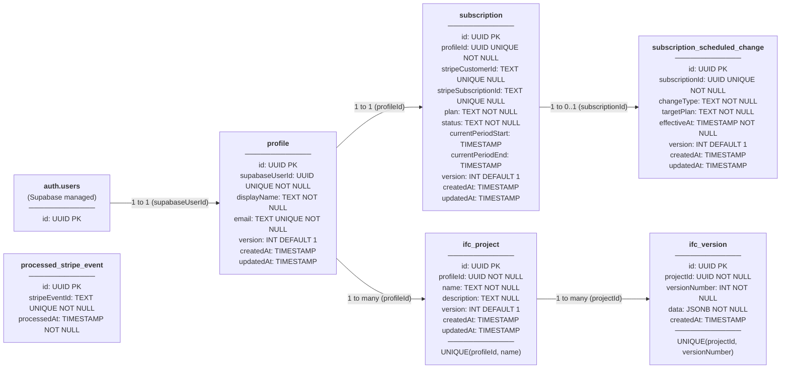

# Database Schema

## Metadata

| Field            | Value      |
|------------------|------------|
| **Status**       | Draft      |
| **Last Updated** | 2026-03-16 |
| **Reviewed By**  | Pending    |

---

## Schema Diagram

---

## Table Definitions

### profile

| Column          | Type      | Constraints              | Description                                               |
|-----------------|-----------|--------------------------|-----------------------------------------------------------|
| id              | UUID      | PK                       | Application-generated primary key                         |
| supabaseUserId  | UUID      | UNIQUE NOT NULL          | Foreign key to `auth.users.id` (managed by Supabase)      |
| displayName     | TEXT      | NOT NULL                 | User's display name (set during sign-up)                  |
| email           | TEXT      | UNIQUE NOT NULL          | User's email address (kept in sync with Supabase auth)    |
| version         | INT       | NOT NULL DEFAULT 1       | Optimistic locking counter                                |
| createdAt       | TIMESTAMP | NOT NULL DEFAULT now()   | Record creation timestamp                                 |
| updatedAt       | TIMESTAMP | NOT NULL (auto-updated)  | Last modification timestamp                               |

**Relationships:**
- `supabaseUserId` → `auth.users.id` (1-to-1 — one profile per Supabase user)

**Notes:**
- Created immediately after a successful Supabase sign-up, before the user's first sign-in.
- `email` is stored here for application-level queries; the authoritative email lives in `auth.users`. The two are kept in sync on email-change flows.
- `supabaseUserId` is the bridge between Supabase-managed auth and application data.

---

### subscription

| Column               | Type      | Constraints              | Description                                                                                           |
|----------------------|-----------|--------------------------|-------------------------------------------------------------------------------------------------------|
| id                   | UUID      | PK                       | Application-generated primary key                                                                     |
| profileId            | UUID      | UNIQUE NOT NULL          | Foreign key to `profile.id` — one subscription per profile                                            |
| stripeCustomerId     | TEXT      | UNIQUE NULL              | Stripe Customer ID (`cus_…`). `NULL` for users who have never subscribed to a paid plan               |
| stripeSubscriptionId | TEXT      | UNIQUE NULL              | Stripe Subscription ID (`sub_…`). `NULL` for users on the Free plan with no active Stripe subscription|
| plan                 | TEXT      | NOT NULL                 | The user's currently active plan. Values: `free`, `hobby`, `investor`                                 |
| status               | TEXT      | NOT NULL DEFAULT 'inactive' | Subscription status from Stripe. Values: `active`, `past_due`, `canceled`, `inactive`              |
| currentPeriodStart   | TIMESTAMP | NULL                     | Start of the current billing period sourced from Stripe. `NULL` for the Free plan                     |
| currentPeriodEnd     | TIMESTAMP | NULL                     | End of the current billing period sourced from Stripe. `NULL` for the Free plan                       |
| version              | INT       | NOT NULL DEFAULT 1       | Optimistic locking counter                                                                            |
| createdAt            | TIMESTAMP | NOT NULL DEFAULT now()   | Record creation timestamp                                                                             |
| updatedAt            | TIMESTAMP | NOT NULL (auto-updated)  | Last modification timestamp                                                                           |

**Relationships:**
- `profileId` → `profile.id` (1-to-1 — every profile has exactly one subscription record)
- `id` ← `subscription_scheduled_change.subscriptionId` (1-to-0..1 — a subscription may have at most one pending change)

**Notes:**
- Created with `plan = 'free'`, `status = 'inactive'`, and all Stripe fields `NULL` immediately after the profile is created (during sign-up).
- `stripeCustomerId` is populated when the user completes their first Stripe Checkout session (`checkout.session.completed` webhook). It is never reset once assigned.
- `stripeSubscriptionId` is populated from the `checkout.session.completed` webhook and updated on subsequent `customer.subscription.updated` events. It is set to `NULL` when a subscription is deleted and the user reverts to Free.
- All `plan`, `status`, and billing period fields are updated exclusively by the webhook processor (see UC-SYS-001); they are never written directly from a user action.
- `plan` and `status` values are validated at the application/domain layer — not via a database enum.

---

### subscription_scheduled_change

| Column         | Type      | Constraints             | Description                                                                                              |
|----------------|-----------|-------------------------|----------------------------------------------------------------------------------------------------------|
| id             | UUID      | PK                      | Application-generated primary key                                                                        |
| subscriptionId | UUID      | UNIQUE NOT NULL         | Foreign key to `subscription.id` — enforces at most one pending change per subscription                  |
| changeType     | TEXT      | NOT NULL                | The type of scheduled change. Values: `downgrade`, `cancel`                                              |
| targetPlan     | TEXT      | NOT NULL                | The plan to switch to when the change takes effect. Values: `free`, `hobby`, `investor`                  |
| effectiveAt    | TIMESTAMP | NOT NULL                | The date and time at which the change will take effect (the current billing period end date from Stripe)  |
| version        | INT       | NOT NULL DEFAULT 1      | Optimistic locking counter                                                                               |
| createdAt      | TIMESTAMP | NOT NULL DEFAULT now()  | Record creation timestamp                                                                                |
| updatedAt      | TIMESTAMP | NOT NULL (auto-updated) | Last modification timestamp                                                                              |

**Unique constraint:** `UNIQUE(subscriptionId)` — enforces that only one pending change may exist per subscription at any time.

**Relationships:**
- `subscriptionId` → `subscription.id` (many-to-one, constrained to 0..1 by the unique constraint)

**Notes:**
- Populated exclusively by the webhook processor (UC-SYS-001) when Stripe reports a `customer.subscription.updated` event with `cancel_at_period_end: true` (sets `changeType = 'cancel'`) or a plan change scheduled at period end (sets `changeType = 'downgrade'`).
- `changeType` distinguishes a scheduled cancellation from a downgrade so the UI can display the correct message without ambiguity.
- Both `cancel` and `downgrade` to Free set `targetPlan = 'free'`; `changeType` differentiates them.
- When a subsequent `customer.subscription.updated` event removes or changes the scheduled change, the existing row is **replaced** (upserted) or **deleted** accordingly.
- When an upgrade webhook is received, this row is **deleted** — the pending change is superseded.
- The transition to the target plan is applied by Stripe at the period end; the application is notified via a `customer.subscription.updated` or `customer.subscription.deleted` webhook at that time and updates the `subscription` row accordingly. This table row is then deleted.

---

### processed_stripe_event

| Column        | Type      | Constraints                | Description                                                                     |
|---------------|-----------|----------------------------|---------------------------------------------------------------------------------|
| id            | UUID      | PK                         | Application-generated primary key                                               |
| stripeEventId | TEXT      | UNIQUE NOT NULL            | The Stripe event ID (`evt_…`) — used to detect and reject duplicate deliveries  |
| processedAt   | TIMESTAMP | NOT NULL DEFAULT now()     | Timestamp when the event was successfully processed                             |

**Unique constraint:** `UNIQUE(stripeEventId)` — prevents the same Stripe event from being processed more than once.

**Relationships:** None — standalone audit/idempotency table.

**Notes:**
- A row is inserted at the start of handling each incoming Stripe webhook event, inside the same transaction that updates subscription state. If the insert fails due to a unique constraint violation, the event has already been processed and is skipped (HTTP 200 returned without state change).
- This table is the sole mechanism for webhook idempotency (see UC-SYS-001, scenario S-095).
- No `version` column is needed — rows are insert-only; they are never updated.
- Old rows may be periodically pruned after a retention window (e.g., 90 days) once they are well past Stripe's retry window.

---

### ifc_project

| Column      | Type      | Constraints              | Description                                                                                         |
|-------------|-----------|--------------------------|-----------------------------------------------------------------------------------------------------|
| id          | UUID      | PK                       | Application-generated primary key                                                                   |
| profileId   | UUID      | NOT NULL                 | Foreign key to `profile.id` — the owning user                                                       |
| name        | TEXT      | NOT NULL                 | Project name. Must be unique per user (not globally). Maximum 255 characters                        |
| description | TEXT      | NULL                     | Optional free-text description of the project                                                       |
| version     | INT       | NOT NULL DEFAULT 1       | Optimistic locking counter                                                                          |
| createdAt   | TIMESTAMP | NOT NULL DEFAULT now()   | Record creation timestamp. Immutable — never updated after creation                                 |
| updatedAt   | TIMESTAMP | NOT NULL (auto-updated)  | Last metadata update timestamp. Corresponds to `lastUpdatedAt` in UC-USR-016. Updated only when `name` or `description` changes — not when an `ifc_version` snapshot is added |

**Unique constraint:** `UNIQUE(profileId, name)` — project names are unique per user, not globally.

**Relationships:**
- `profileId` → `profile.id` (many-to-1 — a user may own many projects)
- `id` ← `ifc_version.projectId` (1-to-many — a project has many version snapshots)

**Notes:**
- Created with an initial `ifc_version` row (`versionNumber = 1`) in the same transaction so a project always has at least one version.
- Deleting a project cascades to all associated `ifc_version` rows. The API requires `?confirm=true` when the project has IFC data (any `ifc_version` row with `versionNumber > 1`) to prevent accidental loss.
- `updatedAt` is **not** bumped when a new `ifc_version` snapshot is appended — only when the project's own `name` or `description` is PATCHed. This ensures the list ordering by `lastUpdatedAt` reflects metadata activity, not model mutation activity.
- Another user's project returns `404 Not Found` (not `403`) to avoid confirming existence.

---

### ifc_version

| Column        | Type      | Constraints             | Description                                                                                            |
|---------------|-----------|-------------------------|--------------------------------------------------------------------------------------------------------|
| id            | UUID      | PK                      | Application-generated primary key                                                                      |
| projectId     | UUID      | NOT NULL                | Foreign key to `ifc_project.id`                                                                        |
| versionNumber | INT       | NOT NULL                | Sequential version number starting at 1. Increments by exactly 1 per committed mutation               |
| data          | JSONB     | NOT NULL                | Full IFC model serialised as IFC-JSON. Represents the complete model state at this version snapshot    |
| createdAt     | TIMESTAMP | NOT NULL DEFAULT now()  | When this version snapshot was persisted. Immutable                                                    |

**Unique constraint:** `UNIQUE(projectId, versionNumber)` — prevents duplicate version numbers within a project.

**Relationships:**
- `projectId` → `ifc_project.id` (many-to-1, cascade delete — snapshots are deleted with the project)

**Notes:**
- Rows are insert-only (immutable snapshots). No `version` optimistic locking column is needed.
- The current model state is the row with `MAX(versionNumber)` for a given `projectId`.
- Read-only GET requests (download, query, list elements) do **not** create a new row.
- Every successful mutation (element create/update/delete, property change, material assignment, etc.) appends a new row with `versionNumber = current_max + 1` in the same transaction as the mutation. If the snapshot insert fails, the mutation is rolled back.
- Restoring a historical version copies its `data` JSONB as a new row with the next sequential `versionNumber` — the original row is never modified.
- The `data` column stores the full IFC model as an IFC-JSON object. Individual element queries and mutations operate on this JSONB in-place and then write the modified document as a new version row.

---

## Change Log

| Date       | Change                                                                                                                | Reason                                                             | Approved By         |
|------------|-----------------------------------------------------------------------------------------------------------------------|--------------------------------------------------------------------|---------------------|
| 2026-05-25 | Initial schema — `profile` table                                                                                      | Project setup; required by Auth module                             | Pending             |
| 2026-03-06 | Added `subscription` and `subscription_scheduled_change` tables                                                       | Subscription feature (UC-USR-011 – UC-USR-014)                    | Approved 2026-03-06 |
| 2026-03-06 | Added `stripeCustomerId`, `stripeSubscriptionId`, `status` to `subscription`; added `changeType` to `subscription_scheduled_change`; added `processed_stripe_event` table | Stripe integration (UC-USR-012 – UC-USR-014, UC-SYS-001) | Pending |
| 2026-03-16 | Added `ifc_project` and `ifc_version` tables | IFC project management and versioned IFC storage (UC-USR-015, UC-USR-016, F-015 – F-028) | Pending |
